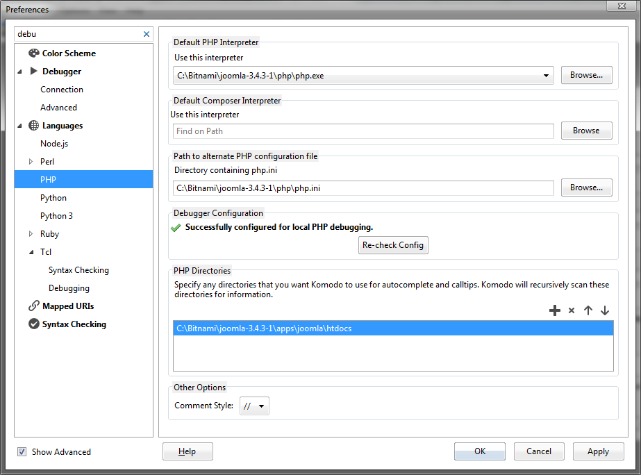
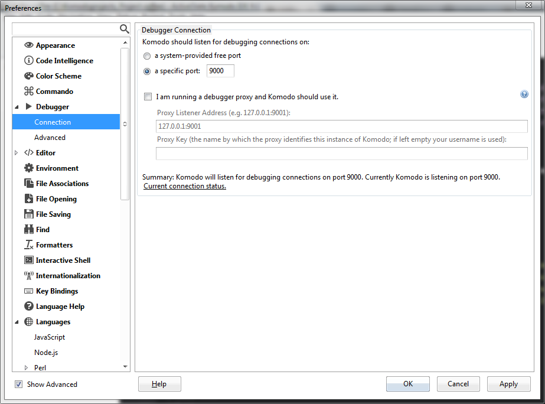
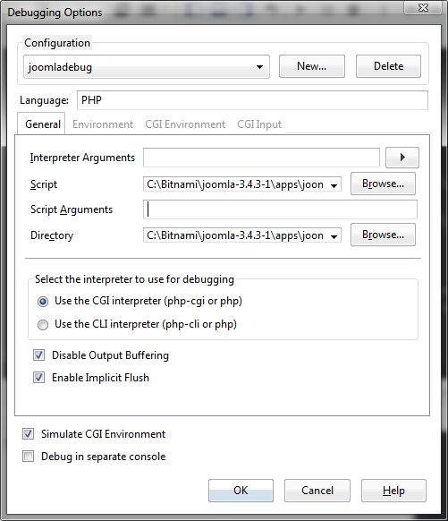

# Debugging Setup for Windows
# Debugging
## Installation ##
WIP

## Download and install Komodo IDE##

Download and install Komodo IDE

## Create a project ##

Open up Komodo and create a project in your installed Bitnami

located on Windows 'C:\Bitnami\joomla-3.4.3-1\apps\joomla\htdocs' this will display all files in the left side panel of the IDE.

This will allow you to directly edit and debug your code.

## Configure IDE for debugging ##

### Modifying the php.ini file###

In order to use the debugger you need to modify the php.ini file of the Apache server you are using.
Follow these instructions

On Windows using Bitnami

-  Goto 'C:\Bitnami\joomla-3.4.3-1\php\php.ini'
- open up this file with your favorite text editor
- do a search for xdebug you should find something like this:
    

		
		;[XDebug]
		;; Only Zend OR (!) XDebug
		;zend_extension="C:/Bitnami/joomla-3.4.3-1/php\ext\php_xdebug.dll"
		;xdebug.remote_enable=true
		;xdebug.remote_host=127.0.0.1
		;xdebug.remote_port=9000
		;xdebug.remote_handler=dbgp
		;xdebug.profiler_enable=1
		;xdebug.profiler_output_dir=C:\Windows\Temp
		    

Delete the ; in front of the text under ';; Only Zend OR (!) XDebug' so it reads like this:

	    
	    ;[XDebug]
	    ;; Only Zend OR (!) XDebug
	    zend_extension="C:/Bitnami/joomla-3.4.3-1/php\ext\php_xdebug.dll"
	    xdebug.remote_enable=true
	    xdebug.remote_host=127.0.0.1
	    xdebug.remote_port=9000
	    xdebug.remote_handler=dbgp
	    xdebug.profiler_enable=1
	    xdebug.profiler_output_dir=C:\Windows\Temp
	    

Then do a search for implicit_flush you will find

        implicit_flush = Off

Change the Off to On

        implicit_flush = On

Save your changes

Restart your Apache server so the changes will take effect.

###In the IDE###
Open up preferences select--> languages -->PHP

####Default php interpreter####

Under the label 'Default php interpreter' use the following:
goto 'Use this interpreter' browse to
C:\Bitnami\joomla-3.4.3-1\php

* Under the label 'Default composer interpreter' browse to
C:\Bitnami\joomla-3.4.3-1\php 

* Under the label 'Path to alternative PHP configuration file' browse to
 C:\Bitnami\joomla-3.4.3-1\php\php.ini

####Listen for debugging####
Then select in preferences -->Debugger-->Connection

#####Debugger Connection#####

Under 'Komodo should listen for debugging connections on:' 
Change option to 'a specific port:9000'
make sure it is set to 9000 this is what should be set in the php.ini file.

Open up preferences select--> languages -->PHP
Under the debugger Configuration you should see 'Successfully configured for local PHP debugging.' If not you can click on 'Re-check Config'

Click OK to save changes

#####Debugging options#####

Under the debug menu select 'Step In' this will open up a new window titled 'Debugging Options'.
Create a new configuration name it 'joomlaphp' click ok

* In 'Language' enter in PHP

* In 'Interpreter Arguments' click on the arrow to the right of the area 
select 'look for php.ini file in this directory'.
browse to C:\Bitnami\joomla-3.4.3-1\php
it will then display '-c C:\Bitnami\joomla-3.4.3-1\php'

* In 'Script' browse to 
C:\Bitnami\joomla-3.4.3-1\apps\joomla\htdocs\index.php

* In 'Directory' browse to 
C:\Bitnami\joomla-3.4.3-1\apps\joomla\htdocs

Under the label 'Select the interpreter to use for debugging select option' - 'Use the CGI interpreter (php-cgi or php)'.

When ok is clicked it will start to run and open up the index.php and stop at the first entry point.
From there you can go/continue, step in, step over, and step out.

If go/continue is selected it will goto the first breakpoint in your code if you have created one.

